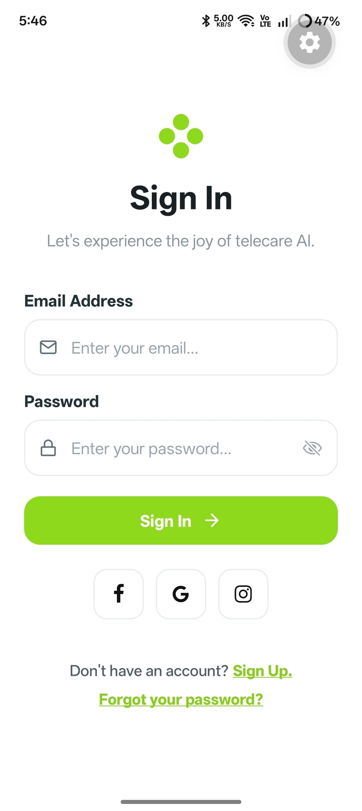
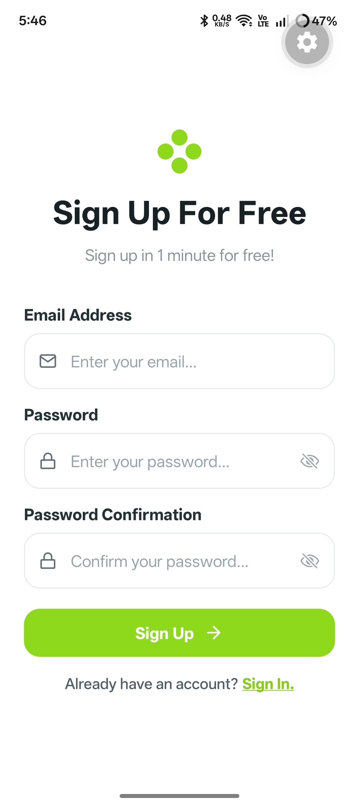
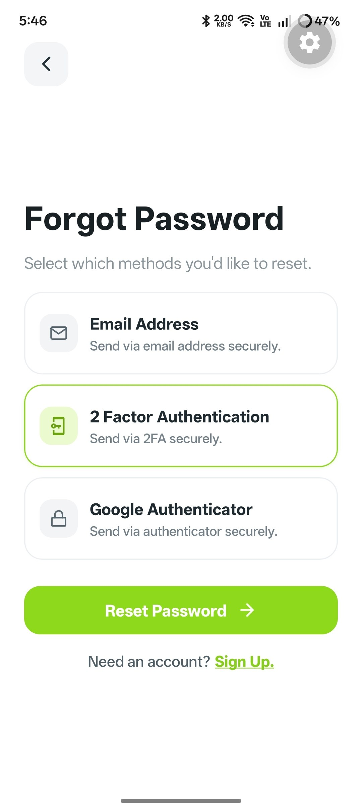

# Build a React Native Sign In Screen

> **Mobile Development Cohort**

**Dribbble Reference:**  
https://dribbble.com/shots/24783022-osler-AI-Telehealth-Telemedicine-App-Sign-In-Sign-Up-UI

## App Screenshot

  
  
  

